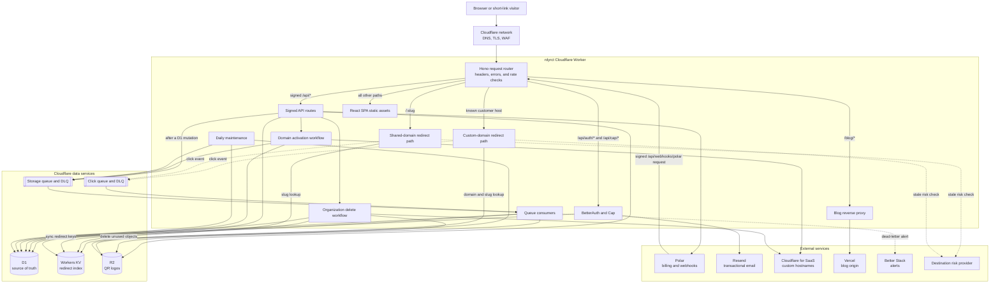
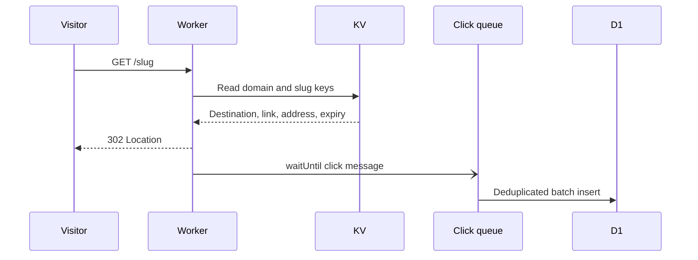
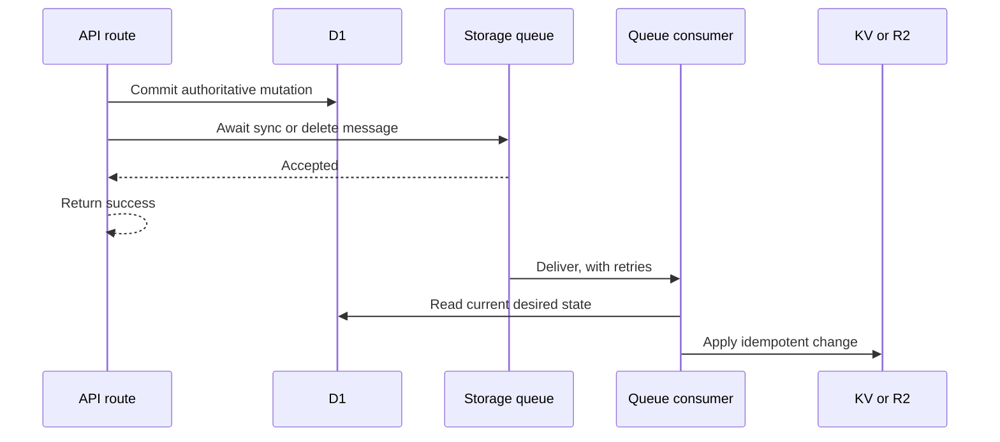

# Architecture

This document describes the production architecture as it exists on August 11, 2026. It also records where the design should change, where it should wait for
data, and which parts should stay simple.

## System diagram

The diagram shows the logical components. The router, API, queue consumers,
scheduled handler, and Workflow entry points ship from the same Worker code.
Polar, Resend, the risk provider, and the Vercel blog remain separate services.

## Code map

| Concern                                                            | Main source                                             |
| ------------------------------------------------------------------ | ------------------------------------------------------- |
| Route order, redirect response, queue dispatch, and scheduled work | `src/worker/index.ts`                                   |
| D1 schema and indexes                                              | `src/worker/db/schema.ts` and `migrations/`             |
| D1-to-KV and D1-to-R2 sync                                         | `src/worker/storage.ts`                                 |
| KV key reads                                                       | `src/worker/kv.ts`                                      |
| Click queue producer and consumer                                  | `src/worker/clicks.ts`                                  |
| Domain activation and organization deletion                        | `src/worker/workflows.ts`                               |
| Authentication and sessions                                        | `src/worker/better-auth.ts` and `src/worker/session.ts` |
| API route groups                                                   | `src/worker/routes/`                                    |
| Browser data access and cache                                      | `src/app/lib/api.ts` and `src/app/lib/hooks.ts`         |
| Cloudflare bindings and queue policy                               | `wrangler.jsonc`                                        |

## Request routing

Route order matters because the Worker serves several products from one host:

1. The security-header middleware wraps each response except the proxied blog,
   which controls its own headers.
2. A request on a known customer domain is redirect-only. The Worker reads the
   domain and slug from KV, returns a `302`, and does not expose the API or SPA.
3. `/api/auth/*`, `/api/cap/*`, and the anonymous shortener are public, with
   their own abuse controls. BetterAuth stores auth state in D1.
4. `/api/webhooks/polar` is public but verifies Polar's signature.
5. The rest of `/api/*` loads a session, applies the signed API rate limit, and
   routes to user, organization, link, QR logo, billing, invite, domain, or
   admin handlers.
6. `/blog/*` proxies to the separate Vercel blog and strips cookies and
   authorization headers before the request leaves Cloudflare.
7. A non-reserved `/:slug` on `rdyrct.com` checks KV for a shared-domain link.
8. Every remaining path goes to the static asset binding. Its SPA fallback lets
   React Router own app and public pages.

## Data ownership and consistency

| Data                                                                              | Authoritative store           | Read path                                   | Write and recovery model                                                                                   |
| --------------------------------------------------------------------------------- | ----------------------------- | ------------------------------------------- | ---------------------------------------------------------------------------------------------------------- |
| Users, sessions, organizations, links, domains, plans, invites, and audit records | D1                            | API reads D1                                | API routes write D1                                                                                        |
| Shared and custom-domain redirects                                                | D1                            | Redirects read KV                           | After a D1 write, a storage queue message rebuilds or deletes the KV value from current D1 state           |
| Click events                                                                      | D1                            | Analytics routes query D1                   | Redirects send best-effort queue messages; the consumer inserts deduplicated batches                       |
| QR logos                                                                          | R2, with the owning URL in D1 | Signed org route reads R2                   | Uploads write R2; replacements and deletes enqueue cleanup; a daily orphan sweep removes abandoned uploads |
| Custom hostname state                                                             | D1 plus Cloudflare for SaaS   | API reads D1; redirect host lookup reads KV | A Workflow creates the hostname, polls DNS and TLS, records state in D1, then publishes KV                 |
| Billing entitlement                                                               | D1, derived from Polar events | API reads D1                                | Signature-checked webhooks apply idempotent, timestamp-ordered updates                                     |

The storage queue carries instructions, not snapshots. A `kv_sync` message names
one key, and its consumer reads current D1 state before it changes KV. This makes
duplicate and out-of-order messages safe. R2 deletes and Workflow steps are also
designed to run more than once.

There are two distinct consistency promises:

- D1 is the product truth. API reads after a successful write use D1.
- KV is a fast, eventually consistent redirect index. Cloudflare states that a
  changed or deleted value can take 60 seconds or more to become visible in
  another location, including a cached negative lookup. Link edits, deletes,
  domain changes, and suspensions therefore do not have a global instant-effect
  guarantee. See [How Workers KV works](https://developers.cloudflare.com/kv/concepts/how-kv-works/).

## Main runtime flows

### Redirect and analytics

The redirect does not wait for D1 or click storage. Anonymous links skip click
recording. Registered links rate-limit click analytics by organization. Queue
send failures do not block redirects, so analytics are intentionally best-effort.

### Link or domain mutation

If the queue send fails after the D1 commit, the request returns an error even
though D1 has changed. If all consumer retries fail, the dead-letter consumer
alerts Better Stack and acknowledges the message. No process then repairs or
replays that change. This is the largest correctness gap in the current design.

### Long-running operations

Cloudflare Workflows handle operations that need ordered, durable steps:

- Domain activation gets or creates the Cloudflare custom hostname, polls DNS
  and TLS for up to one day, updates D1, then asks the storage queue to publish
  the active domain to KV.
- Organization deletion gathers external keys, deletes the D1 organization and
  its dependent rows, then removes Cloudflare hostnames, KV keys, and the R2
  prefix. Each step is safe to retry.

The daily scheduled handler trims old clicks, clears expired queue dedupe IDs,
removes orphan QR logos, retires expired aliases, and deletes expired anonymous
links.

## Architecture review

### Do now

| Priority | Improvement                                         | Why it matters                                                                                                                                                                                                                                           | Recommended shape                                                                                                                                                                                                                                                                                                          |
| -------- | --------------------------------------------------- | -------------------------------------------------------------------------------------------------------------------------------------------------------------------------------------------------------------------------------------------------------- | -------------------------------------------------------------------------------------------------------------------------------------------------------------------------------------------------------------------------------------------------------------------------------------------------------------------------- |
| P0       | Choose and document the redirect revocation promise | KV is the right read store, but an edit, delete, or suspension can remain stale at some locations. This matters most for abuse response, not normal edits.                                                                                               | Decide whether a delay of 60 seconds or more is acceptable. If it is, state it in operator and product guidance and add an emergency host or slug block at the WAF or Worker layer. If instant global revocation is required, test a strongly consistent gate for suspended links before changing the whole redirect path. |
| P1       | Define service indicators before tuning             | `observability.enabled` and Better Stack alerts give logs, but the repository does not define targets for redirect latency, stale redirects, queue lag, click loss, D1 cost, or Workflow failures. Without them, an optimization cannot prove its value. | Track redirect latency and error rate, KV misses, storage and click queue lag, DLQ count, D1 query latency and rows read, scheduled-job results, Workflow failures, and external provider errors. Set an alert and owner for each correctness-critical signal.                                                             |
| P1       | Isolate scheduled maintenance failures              | The five daily jobs run in sequence. One thrown error stops the jobs after it until the next day. Some jobs loop until no rows remain, so one run can also become long as data grows.                                                                    | Give each job its own guarded execution and alert, or move the long jobs into Workflows. Record counts, duration, and the last successful completion for each job.                                                                                                                                                         |
| P1       | Restore the recovery runbook                        | Storage and click DLQs alert, but there is no checked-in procedure for inspection, replay, or verification. `docs/storage-recovery.md` held one and was deleted in 9f43602 as outdated, while #15 closed pointing at it.                                 | Rewrite it: identify the failed key, compare it with D1, reapply the idempotent storage operation, confirm KV or R2, close the alert. Keep click loss separate because it is an accepted analytics tradeoff.                                                                                                               |

Tracked as #101 (revocation), #31 (indicators, per-job reporting, runbook).

Cloudflare documents that a DLQ is an ordinary queue that needs its own
consumer, and that unconsumed messages expire. The current consumer prevents
silent expiry, but it also means the alert is the last durable trace of the
message. See [Cloudflare Queues dead-letter queues](https://developers.cloudflare.com/queues/configuration/dead-letter-queues/).

### Improve when measurements justify it

| Trigger                                                                   | Improvement                                  | Evaluation                                                                                                                                                                                                                                                                                                                                                                                                                                                                                                                                                               |
| ------------------------------------------------------------------------- | -------------------------------------------- | ------------------------------------------------------------------------------------------------------------------------------------------------------------------------------------------------------------------------------------------------------------------------------------------------------------------------------------------------------------------------------------------------------------------------------------------------------------------------------------------------------------------------------------------------------------------------ |
| The organization stats endpoint becomes slow or expensive in D1 metrics   | Add click rollups                            | One stats request currently runs many concurrent counts and groupings over the same click range. Existing `(org_id, ts)`, `(link_id, ts)`, and `(address_id, ts)` indexes are a good base. Check query plans and `rows_read` first. At sustained volume, update hourly and daily rollup tables in the click consumer and keep raw rows for the recent feed and detailed analysis.                                                                                                                                                                                        |
| Storage dead letters or producer send failures stop being rare            | Reconsider a D1 outbox                       | A D1 commit and a queue send are not atomic, so a failed send can leave KV or R2 stale while the client sees an error, and a dead letter is alerted but not repaired. #15 weighed an outbox table, a dead-letter table, a redrive path and a reconciliation cron, and rejected all of them in favour of trusting Queues' retry and alerting on the rare terminal give-up. That decision stands until something counts how often it happens: give DLQ depth and producer send failures a metric and a threshold (#31), and revisit with evidence rather than by argument. |
| One invalid click causes repeated batch failures or measurable click loss | Isolate poison click messages (#102)         | Clicks enter D1 as one atomic batch. A click whose link was deleted can fail the whole batch, including valid peers. On final retry, split the batch or validate missing parents so one stale event cannot amplify loss across up to a full batch. Keep redirects best-effort.                                                                                                                                                                                                                                                                                           |
| Read latency is high for users far from the D1 primary                    | Test D1 read replication                     | Read replication can lower read latency and raise read throughput, but it only works through the D1 Sessions API. The application must also carry bookmarks when it needs read-your-own-write behavior. Measure by region before adding this consistency work. See [D1 global read replication](https://developers.cloudflare.com/d1/best-practices/read-replication/).                                                                                                                                                                                                  |
| The daily QR sweep approaches memory or execution limits                  | Page references or maintain an object ledger | The sweep currently loads every non-empty logo URL from links and organizations into memory, then lists all R2 objects. This is simple and safe at current scale. Page by organization or track claimed objects only when object and row counts make the full scan costly.                                                                                                                                                                                                                                                                                               |
| Click volume makes raw D1 storage or aggregate reads the main cost        | Compare rollups with Analytics Engine        | Workers Analytics Engine is built for high-cardinality event data, but it can sample at high volume and would add a second query model. Exact customer analytics and relational joins favor D1 today. Test it for operational telemetry or approximate aggregates before moving product analytics. See [Workers Analytics Engine](https://developers.cloudflare.com/analytics/analytics-engine/).                                                                                                                                                                        |
| Blog proxy errors or latency become material                              | Move or cache the blog closer to the Worker  | `/blog/*` adds a Vercel dependency and a Worker-to-origin request. If the blog is mostly static, publishing its output with Cloudflare assets would remove a failure boundary. Keep the proxy while independent deploys are worth more than that simplification.                                                                                                                                                                                                                                                                                                         |

### Keep as designed

- Keep one Worker. The route order is clear, deployment is simple, and the API,
  redirect, queue, cron, and Workflow code share types and bindings. Splitting it
  now would add releases and network boundaries without removing a measured
  bottleneck.
- Keep KV on the redirect hot path. The workload is read-heavy and tolerates
  eventual consistency for routine changes. D1 fallback on every KV miss would
  weaken the latency and load benefits and would make cached negative lookups
  less useful.
- Keep D1 as the source of truth. It gives auth, ownership, plan enforcement,
  address history, and analytics one relational model with foreign keys.
- Keep queues between redirects and analytics. Redirect availability should not
  depend on D1 writes.
- Keep Workflows for domain activation and organization deletion. Both operations
  need ordered retries across D1 and external systems.
- Keep R2 for logos. The objects are immutable, private, small, and naturally
  separate from relational rows.
- Do not add Durable Objects to every redirect only to make ordinary edits
  immediate. That would put a stateful hop on the main product path. Consider a
  narrow suspension gate only if the revocation requirement and measurements
  justify it.

## Recommended order

1. Set the redirect revocation policy and operational service indicators.
2. Count storage dead letters and producer send failures, and write the recovery
   runbook. Durable delivery is a decision that waits on those counts.
3. Isolate each maintenance job and record its outcome.
4. Measure D1 analytics queries with production row counts and query plans.
5. Add rollups, read replication, or another analytics store only when those
   measurements cross an agreed limit.

This order improves correctness and visibility before it adds new data systems.
It also preserves the current redirect path, which is the strongest part of the
design.
